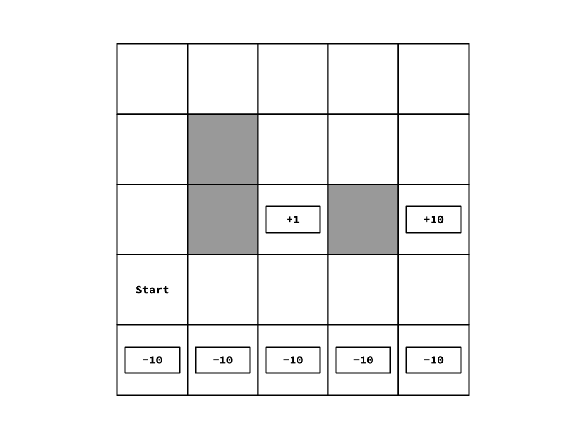

# Problem Set 3: Reinforcement Learning

The goal of this problem set is to implement and get familiar with Reinforcement Learning.

To run the autograder, type the following command in the terminal:

    python autograder.py

If you wish to run a certain problem only (e.g. problem 1), type:

    python autograder.py -q 1

where 1 is the number of the problem you wish to run.

You can also specify a single testcase only (e.g. testcases01.json in problem 1) by typing:

    python autograder.py -q 1/testcases01.json

To debug your code through the autograder, you should disable the timeout functionality. This can be done via the `debug` flag as follow:

    python autograder.py -d -q 1/testcases01.json

Or you could set a time scale to increase or decrease your time limit. For example, to half your time limits, type:

    python autograder.py -t 0.5 -q 1/testcases01.json

## Instructions

In the attached python files, you will find locations marked with:

    #TODO: ADD YOUR CODE HERE
    NotImplemented()

Remove the `NotImplemented()` call and write your solution to the problem. **DO NOT MODIFY ANY OTHER CODE**; The grading of the assignment will be automated and any code written outside the assigned locations will not be included during the grading process.

**IMPORTANT**: You must document your code (explain the algorithm you are implementing in your own words within the code) to get the full grade. Undocumented code will be penalized.

**IMPORTANT**: You must fill the **`student_info.json`** file since it will be used to identify you as the owner of this work. The most important field is the **id** which will be used by the automatic grader to identify you.

For this assignment, you should submit the following files only:
- `student_info.json`
- `value_iteration.py`
- `policy_iteration.py`
- `options.py`
- `reinforcement_learning.py`

Put these files in a compressed zip file named `solution.zip` which you should submit to Google Classroom.

## File Structure

There are 5 files that you can run from the terminal:
- `play.py`: where you can play a grid or let an agent play it. This is useful for debugging.
- `train.py`: where you can train a solver to play a grid. This is useful for debugging.
- `autograder.py`: where you test your code and get feedback about your results for the test cases.
- `speed_test.py`: where you can check your computer's speed, which is useful to predict how long your code will take to run on the grading machine.

These are the files relevant to the requirements:
- `mathutils.py` **[IMPORTANT]**: This contains some useful math utilities. You should understand how to use the classes and functions written in it.
- `mdp.py` **[IMPORTANT]**: This is where the generic MDP (Markov Decision Process) is defined. You should understand the code written in it.
- `environment.py` **[IMPORTANT]**: This is where the generic environment is defined. It wraps an MDP and simulates episodes. This is used to train and run RL agents. You should understand the code written in it.
- `grid.py`: This is where the grid MDP and environment are defined.
- `base_rl.py` **[IMPORTANT]**: This is defines some base classes and definitions needed by other RL code, including the base class for the feature extractor. You should understand the code written in it.
- `features_grid.py`: This is where the features, needed to create the Approximate Q-Learning agent for the grid environment, are defined.
- `agents.py` **[IMPORTANT]**: This is where game agents are defined. You should understand the code written in it.
- `value_iteration.py` **[IMPORTANT + REQUIREMENT]**: This is where the value iteration agent is defined. You should complete the code in this file.
- `options.py` **[IMPORTANT + REQUIREMENT]**: This is where the functions for problem 2 are defined. You should complete the code in this file.
- `policy_iteration.py` **[IMPORTANT + REQUIREMENT]**: This is where the policy iteration agent is defined. You should complete the code in this file.
- `reinforcement_learning.py` **[IMPORTANT + REQUIREMENT]**: This is where the RL agents (SARSA, Q & Approximate Q) are defined. You should complete the code in this file.
- `training_loops.py` **[IMPORTANT]**: This is where the training loops for the RL agents are defined. It is recommended that you understand it.

There are some files defined in the folder `helpers` that are used for testing. You should not need to understand how to use them, but it won't harm to know the following information about them:
- `globals.py`: This only contains some imports that should be seen by all the testing code, so they are defined here to be imported in `autograder.py`.
- `mt19937.py`: This is a pseudo-random number generator. We define our own instead of use the builtin `random` module to ensure that the results are reproduceable regardless of the Python version.
- `rl_utils.py`: This contains some utility functions to compare and print the results onto the console.
- `test_tools.py`: This is where most of the testing code lies. It has pairs of functions `run_*` and `compare_*` to run and check the results of different functions in the requirements. It is relatively complex, and error messages may point you towards this file, if your code returns something wrong that also leads the testing code to crash.
- `utils.py`: This contains some classes and functions that are used by `autograder.py` and `test_tools.py`. This is where the `load_function` lies which is used to dynamically load your solutions from their python files at runtime without using `import`. This ensures that having an error in one file does not stop the autograder from grading the other files.

---

## Problem Definitions

There is one environment defined in this problem set:
1. **Grid World**: where the environment is a 2D grid where the player can move in one of 4 directions (`U`, `D`, `L`, `R`). The actions are noisy so the end result may be moving along one of the 2 directions orthogonal to the desired direction. Some locations `"#"` are occupied with walls so the player cannot stand on them. Some other locations `"T"` are terminal states which ends the episode as soon as the player stands on them. Each location has an associated reward which is given to player if they do an action that gets them to be in that state in the next time step. The markov decision process and environment of the grid world is implemented in `grid.py` and the environment instances are included in the `grids` folder.

You can play a grid world game by running:

    # For playing a grid (e.g. grid1.json)  
    python play.py grids\grid1.json

You can also let an learning agent play the game in your place (e.g. a Q-Learning Agent) as follow:

    python play.py grids\grid1.json -a q_learning -m models/model.json

**NOTE:** In addition to the agent, we supply a model file from which the agent will read its data (e.g. Q-values for Q-learing & SARSA agents, weights for approximate Q-learning and Utilities for value iteration agents). If we don't supply a model file, the agent will play using the initial values of their learnable parameters.

To train an agent and save its data in model file, use `train.py` as follows:

    # For training a q_learning agent on grid1.json for 1000 iterations where each episode is limited to 100 steps only
    python play.py q_learning grids\grid1.json models/model.json -i 1000 -sl 100

The agent options are:
- `human` where the human play via the console
- `random` where the computer plays randomly
- `value_iteration` where the agent uses the learned utilities (via value iteration) and the MDP to decide on the action to take.
- `sarsa` where the agent uses the learned Q-value (via SARSA) to decide on the action to take.
- `q_learning` where the agent uses the learned Q-value (via Q-Learning) to decide on the action to take.
- `q_learning_approx` where the agent uses the learned weights (via Linear Approximate Q-Learning) to decide on the action to take.

To get detailed help messages, run `play.py` and `train.py` with the `-h` flag. 

---

## Important Notes

This problem set relies a lot on randomness and Reinforcement Learning usually does not converge to the same results when different random seeds are used. So it is essential to follow the instructions written in the comments around the TODOs to acheive the same results. In addition, while acting, if two actions have the same value (Q-value, expected utilities, etc.), pick the action that appears first in the list returned by `mdp.get_actions` or `env.actions()`.

---

## Problem 1: Value Iteration

Inside `value_iteration.py`, modify the functions marked by a `**TODO**` to complete the `ValueIterationAgent` class. Note that the Reward `R(s, a, s')` is a function of the current state, the action and the next state, so use the appropriate version of the bellman equation:

$$U(s) = \max_{a} \sum_{s'} P(s'|s,a) [ R(s,a,s') + \gamma U(s')]$$

## Problem 2: Parameter Selection

**WARNING**: The problem will run your solution for value iteration problem. So please make sure that your value iteration code is correct before proceeding to this problem.

As shown in  figure above, this MDP has 2 terminal states with positive rewards (one is close to the start with a reward of +1 and far from the start with a reward of +10). To reach any of these 2 states, the agent can either take a short yet dangerous path (going directly right) or take a long yet safe path (going up, then right, then down). The shorter path is dangerous since it extends alongside a row of terminal states with a penalty of -10 each.

The goal of this question is to select values for these 3 parameters (action noise, discount factor and living reward) to control the policy.
* The action noise is the probability that the actual direction of movement ends up being along one of the 2 directions orthogonal to the desired direction. For example, if the noise is 0.2 and the action is up, then the agent has an (1-0.2)=0.8 chance to actually go up and (0.2/2)=0.1 to go left and (0.2/2)=0.1 to go right.
* The discount factor is the gamma as described in the bellman equation.
* The living reward is the reward for going to a non-terminal state. This reward can be positive or negative.
  
In the file `options.py`, there are 6 functions `question2_1` to `question2_6` where each of them returns a dictionary containing the 3 parameters described above. The goal is to select values for there parameters such that the policy behaves as follows:
1. For `question2_1`, we want the policy to seek the near terminal state (reward +1) via the short dangerous path (moving besides the row of -10 state).
2. For `question2_2`, we want the policy to seek the near terminal state (reward +1) via the long safe path (moving away from the row of -10 state).
3. For `question2_3`, we want the policy to seek the far terminal state (reward +10) via the short dangerous path (moving besides the row of -10 state).
4. For `question2_4`, we want the policy to seek the far terminal state (reward +10) via the long safe path (moving away from the row of -10 state).
5. For `question2_5`, we want the policy to avoid any terminal state and keep the episode going on forever.
5. For `question2_6`, we want the policy to seek any terminal state (even ones with the -10 penalty) and try to end the episode in the shortest time possible.

## Problem 3: Policy Iteration

Inside `policy_iteration.py`, modify the functions marked by a `**TODO**` to complete the `PolicyIterationAgent` class. In this problem, you can use `numpy` to solve the linear equations. We recommend that you use the function `numpy.linalg.lstsq`, since it won't raise an error if the given matrix is non-invertible.

## Problem 4: SARSA

Inside `reinforcement_learning.py`, modify the functions marked by a `**TODO**` to complete the `SARSALearningAgent` class. 

$$Q(s,a) \leftarrow Q(s,a) + \alpha(r + \gamma Q(s',a') - Q(s,a))$$

## Problem 5: Q-Learning

Inside `reinforcement_learning.py`, modify the functions marked by a `**TODO**` to complete the `QLearningAgent` class. 

$$Q(s,a) \leftarrow Q(s,a) + \alpha(r + \gamma \max_{a'}Q(s',a') - Q(s,a))$$

## Problem 6: Approximate Q-Learning

Inside `reinforcement_learning.py`, modify the functions marked by a `**TODO**` to complete the `ApproximateQLearningAgent` class. 

$$w_{ia} \leftarrow w_{ia} + \alpha(r + \gamma \max_{a'}Q(s',a') - Q(s,a))w_i$$

where $w_{ia}$ is the the weight of the feature $x_i$ in $Q(s,a)$ and ${x_1, x_2, ..., x_n}$ are the features of the state $s$. Thus the approximate Q-function can be written as follows:

$$Q(s,a) = \sum_i w_{ia}*x_i$$

## Time Limit

In case your computer has a different speed compared to mine (which I will use for testing the submissions), you can use the following information as a reference: `On my computer, running speed_test.py takes ~17 seconds`. You can measure the run time for this operation on computer by running:

    python speed_test.py

If your computer is too slow, you can increase the time limit in the testcases files.

## Delivery

The delivery deadline is `Monday January 2nd 2023 23:59`. It should be delivered on **Google Classroom**. This is an individual assignment. The delivered code should be solely written by the student who delivered it. Any evidence of plagiarism will lead to receiving **zero** points.
